# 엔티티 연관관계도 (ERD)

Crosscert Passkey Platform 의 JPA 엔티티(`core/src/main/java/com/crosscert/passkey/core/entity/`) 간
연관관계입니다. 두 개의 집합(aggregate)으로 나뉩니다.

- **TENANT 집합** — 패스키 운영 데이터 (credential, api_key, 정책·설정)
- **ADMIN_USER 집합** — 관리 콘솔 계정 (recovery code, reset token, invitation)
- 두 집합은 `admin_user.tenant_id` 로 느슨히 연결됩니다 (RP_ADMIN 은 특정 테넌트 소속,
  플랫폼 운영자는 `tenant_id = null`).

> **soft FK 주의**: `CREDENTIAL`·`API_KEY`·`AUDIT_LOG`·`ADMIN_USER` 등 다수 테이블은 JPA 관계
> 어노테이션 없이 `UUID tenantId` 컬럼만으로 연결됩니다(멀티테넌트 VPD `@Filter tenantFilter` 격리를
> 위한 의도된 설계). DB 레벨 FK 제약이 없을 수 있어, 조회 시 tenant 를 식별하려면 JOIN 을 직접 걸어야
> 합니다. ERD 에서는 관계선으로 표기하되 "(soft)" 로 구분합니다.

## 다이어그램

```mermaid
erDiagram
    TENANT ||--o{ TENANT_ALLOWED_ORIGIN : "has (JPA)"
    TENANT ||--o{ TENANT_ACCEPTED_FORMAT : "has (JPA)"
    TENANT ||--o{ TENANT_AAGUID_POLICY : "has (soft)"
    TENANT ||--o| TENANT_WEBAUTHN_SNAPSHOT : "1:1 cache (soft)"
    TENANT ||--o{ CREDENTIAL : "has (soft)"
    TENANT ||--o{ API_KEY : "has (soft)"
    API_KEY ||--o{ API_KEY_SCOPE : "has (JPA)"
    TENANT ||--o{ ADMIN_USER : "scopes RP_ADMIN (soft, nullable)"
    ADMIN_USER ||--o{ ADMIN_USER_RECOVERY_CODE : "has (soft)"
    ADMIN_USER ||--o{ ADMIN_PASSWORD_RESET_TOKEN : "has (soft)"
    ADMIN_USER ||--o{ ADMIN_USER_INVITATION : "has (soft)"
    ADMIN_USER ||--o{ AUDIT_LOG : "actor (soft, nullable)"
    TENANT ||--o{ AUDIT_LOG : "scope (soft, nullable)"

    TENANT {
        RAW16 id PK
        string slug UK
        string display_name
        string rp_id
        string rp_name
        string status
    }
    TENANT_ALLOWED_ORIGIN {
        RAW16 id PK
        RAW16 tenant_id FK
        string origin
    }
    TENANT_ACCEPTED_FORMAT {
        RAW16 id PK
        RAW16 tenant_id FK
        string format
    }
    TENANT_AAGUID_POLICY {
        RAW16 tenant_id PK "soft FK"
        string policy_mode
        char mds_strict
        RAW16 aaguid "element collection"
    }
    TENANT_WEBAUTHN_SNAPSHOT {
        RAW16 tenant_id PK "1행/테넌트"
        string rp_id
        string rp_name
    }
    CREDENTIAL {
        RAW16 id PK
        RAW16 tenant_id "soft FK"
        bytes user_handle
        bytes credential_id
        blob public_key "CBOR"
        long sign_count
        bytes aaguid
        string label
    }
    API_KEY {
        RAW16 id PK
        RAW16 tenant_id "soft FK"
        string key_prefix
        string key_hash "bcrypt"
        string name
        instant expires_at
        instant revoked_at
    }
    API_KEY_SCOPE {
        RAW16 id PK
        RAW16 api_key_id FK
        string scope "registration|authentication"
    }
    ADMIN_USER {
        RAW16 id PK
        string email
        string bcrypt_hash "bcrypt"
        string role "PLATFORM|RP_ADMIN"
        RAW16 tenant_id "soft FK, nullable"
        char mfa_enabled
        string mfa_secret "AES-GCM enc"
        string status
    }
    ADMIN_USER_RECOVERY_CODE {
        RAW16 id PK
        RAW16 admin_user_id "soft FK"
        string code_hash "sha-256"
        instant used_at
    }
    ADMIN_PASSWORD_RESET_TOKEN {
        RAW16 id PK
        RAW16 admin_user_id "soft FK"
        string token_hash "sha-256"
        string token_prefix
        instant expires_at
    }
    ADMIN_USER_INVITATION {
        RAW16 id PK
        RAW16 admin_user_id "soft FK"
        string token_hash "sha-256"
        string token_prefix
        instant expires_at
    }
    AUDIT_LOG {
        RAW16 id PK
        RAW16 actor_id "soft FK, nullable"
        string actor_email
        string action
        RAW16 tenant_id "soft FK, nullable"
        bytes prev_hash "hash chain"
        bytes hash "hash chain"
        clob payload
    }
```

## 독립 테이블 (관계 없음 — 플랫폼 전역)

아래 테이블은 다른 엔티티와 FK 관계가 없는 전역 싱글톤/캐시/인프라입니다.

| 테이블 | 역할 | 비고 |
|---|---|---|
| `SIGNING_KEY` | JWT RS256 서명키 | `public_jwk`(공개, JWKS 노출) + `private_pkcs8`(AES-GCM 암호화) |
| `MDS_BLOB_CACHE` | FIDO MDS 블롭 캐시 | 고정 SINGLETON_ID |
| `SECURITY_POLICY` | 전역 보안 설정 | 싱글톤 (세션 타임아웃·CORS·MFA 필수 등) |
| `SCHEDULER_LEASE` | 배치 리더 선출 lease | `name`·`holder`·`expires_at` |

## 관계 요약표

| 부모 | 자식 | 관계 | 연결 방식 | cascade |
|---|---|---|---|---|
| TENANT | TENANT_ALLOWED_ORIGIN | 1:N | JPA `@ManyToOne` | ALL + orphanRemoval |
| TENANT | TENANT_ACCEPTED_FORMAT | 1:N | JPA `@ManyToOne` | ALL + orphanRemoval |
| TENANT | TENANT_AAGUID_POLICY | 1:N | soft FK + `@ElementCollection` | — |
| TENANT | TENANT_WEBAUTHN_SNAPSHOT | 1:1 | soft FK (테넌트당 1행) | — |
| TENANT | CREDENTIAL | 1:N | soft FK (`UUID tenantId`) | — |
| TENANT | API_KEY | 1:N | soft FK | — |
| API_KEY | API_KEY_SCOPE | 1:N | JPA `@ManyToOne` | ALL + orphanRemoval |
| ADMIN_USER | ADMIN_USER_RECOVERY_CODE | 1:N | soft FK (`admin_user_id`) | — |
| ADMIN_USER | ADMIN_PASSWORD_RESET_TOKEN | 1:N | soft FK | — |
| ADMIN_USER | ADMIN_USER_INVITATION | 1:N | soft FK | — |
| TENANT | ADMIN_USER | 1:N | soft FK (nullable) | — |
| ADMIN_USER | AUDIT_LOG | 1:N | soft FK (`actor_id`, nullable) | — |
| TENANT | AUDIT_LOG | 1:N | soft FK (`tenant_id`, nullable) | — |

> **PK 타입 주의**: 모든 PK/FK 는 Oracle `RAW(16)`(바이너리 UUID) 입니다. DB 직접 조회 시
> `RAWTOHEX(id)` 로 hex 문자열을, tenant 식별은 `tenant` 테이블과 JOIN(`slug`/`display_name`)
> 으로 사람이 읽게 만들 수 있습니다.
